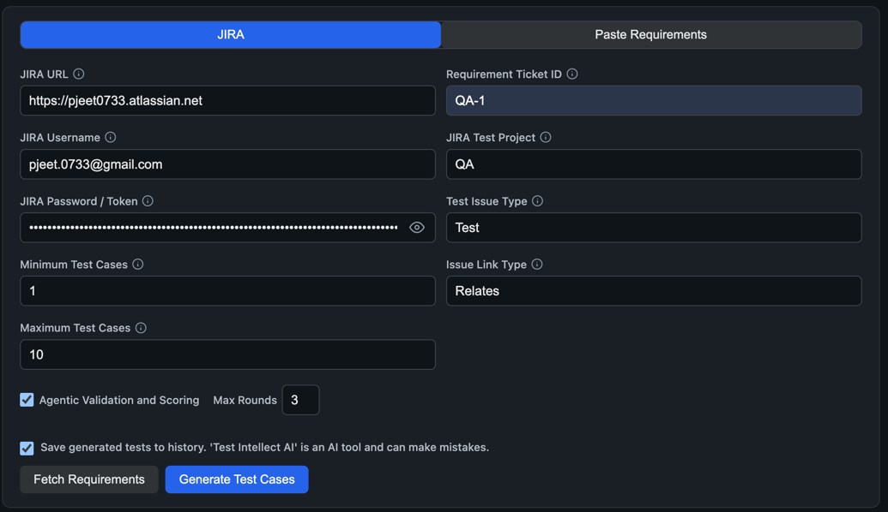
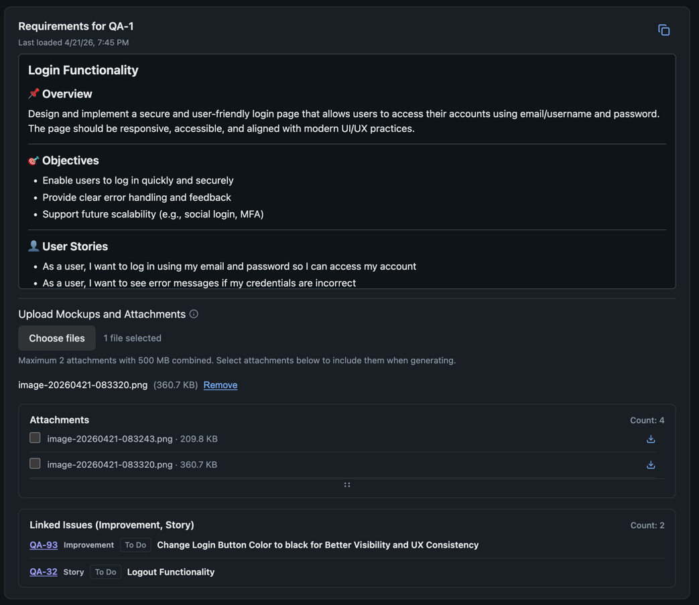
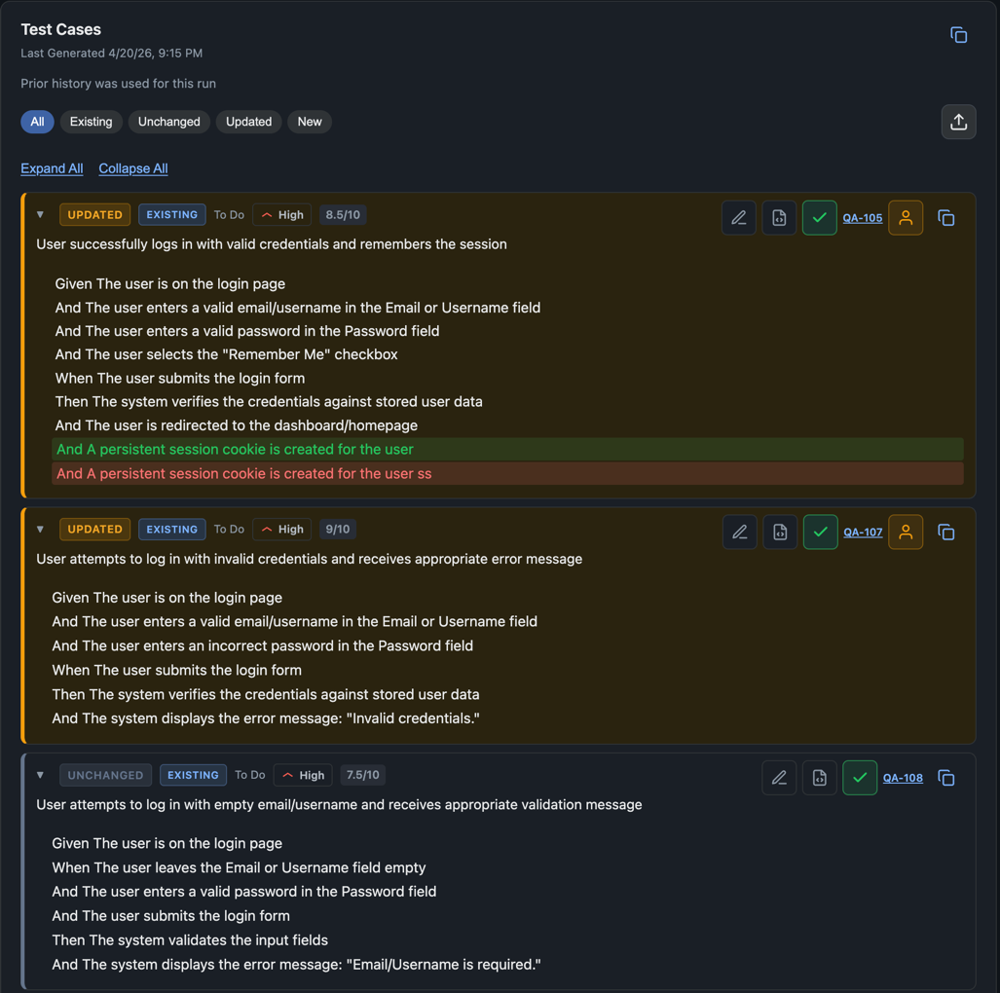
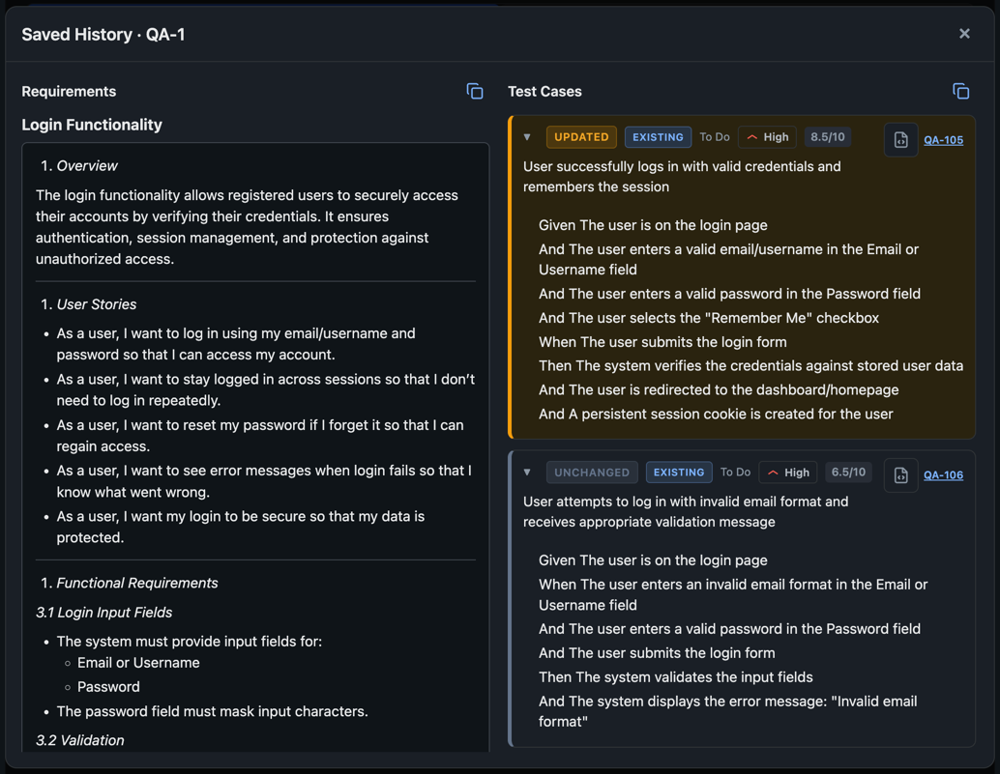
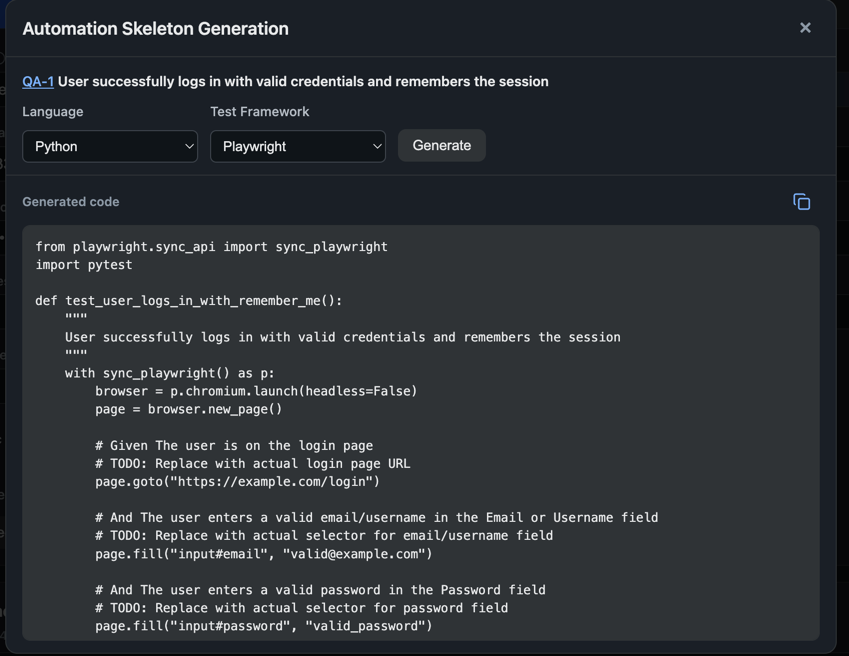
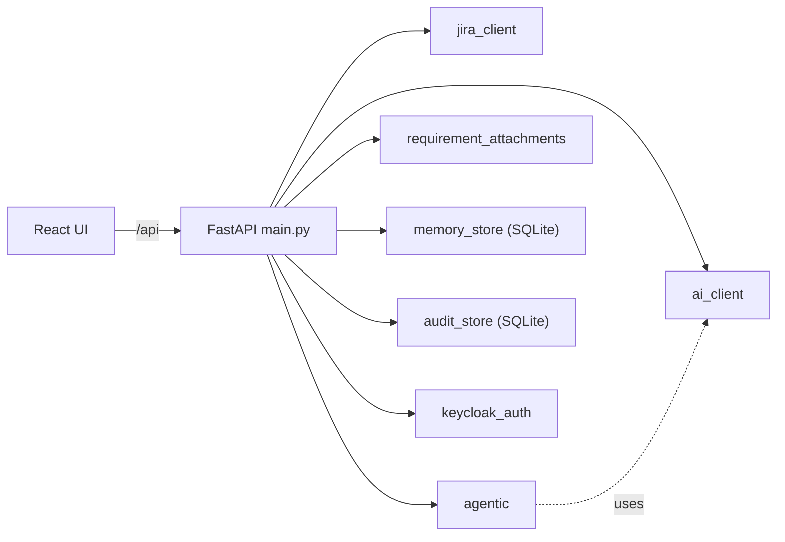

# Test Intellect AI

[](https://www.python.org/)
[](https://fastapi.tiangolo.com/)
[](https://react.dev/)
[](https://vitejs.dev/)
[](https://sqlite.org/) [](https://www.atlassian.com/software/jira)
[](https://platform.openai.com/docs/api-reference)
[](https://www.keycloak.org/)

Web app that pulls JIRA requirements (or pasted text) and uses an OpenAI-compatible LLM or VLM (local or cloud) to generate Gherkin-style test cases.
Set the model via `LLM_URL` (must include /v1) and optionally `LLM_ACCESS_TOKEN` for Bearer auth.

Optionally:

- Save runs per ticket in SQLite 
- Track actions in an audit log 
- Use Keycloak to associate users with activity

---
### Product Sample Video

[Check out the video on YouTube](https://www.youtube.com/watch?v=u5MYzPwuOGI)
<p align="center">
  <a href="https://youtu.be/u5MYzPwuOGI">
    
  </a>
</p>

---
### Product Sample Images

      

---

### Architecture



---

## Features

### Requirements

- **JIRA mode:** Fetch ticket summary + description. Formats (Atlassian Document Format, wiki, HTML) are normalized to plain text.
- **Paste mode:** Generate tests from plain text or Markdown. No JIRA needed.

### AI Test Generation
- Works with any OpenAI-compatible /v1/chat/completions endpoint 
- Supports local (LM Studio) or cloud (OpenAI, Azure, etc.)
- Supports passing Mockups to AI Model
- Outputs structured Gherkin scenarios with steps 
- Configurable min/max test cases (0 = no limit)
- Priorities 
  - Paste mode → from `PASTE_MODE_PRIORITIES` in [.env](.env)
  - JIRA mode → uses project priorities 
- Extras
  - Generate automation code skeletons per test case
- Agnets
  - Two-step agentic flow: validate-and-refine generation
- LLM set score for each test cases out of /10
- Button to delete test case from 'Generate Test Cases' result
  - Delete button will be available for test cases without any JIRA ID

### Auto Test Execution
- Auto Test: BDD steps run in a real browser (Playwright). 
- Saved Suite: Store cases; Run all; optional tag/JIRA filters; optional parallel runs. 
- Environment: Browser, headless, timeout, trace, screenshots-on-pass, parallelism. 
- Output: Status, steps, screenshots, optional post-run analysis. 
- Reports: Suite batch report for full/filtered runs; single runs can have their own report (per your settings). 
- Cleanup: Retention can prune old runs, files, and history.
- Parallel execution support

### History & Comparison
- SQLite keeps the latest requirements and generated tests per ticket (when saving is enabled).
- **Similar Ticket Matching:** If there is no exact-saved row for a key, optional **similar title + description** matching via **`MEMORY_SIMILARITY_THRESHOLD`** in `.env` (`0` = off; try ~`0.88`–`0.95`).
- View history and ticket details and filter by requirement id.
- **Requirements Diffs:** When you regenerate with prior saved data for the **same requirement ticket**, the UI can show a **requirements diff** and **change status** tags on test cases (e.g. new / updated / unchanged).

### JIRA Integration
- Fetch requirements, linked issues, linked tests, attachments
- Generate tests 
- Create or update test issues in JIRA 
- Link tests to requirements (default: Relates)
- Control link direction via `JIRA_LINK_INWARD_IS_REQUIREMENT` in [.env](.env)
- Bulk push supported (filtered by change type)
- Show linked issues, status, and priority 
- Map AI priorities to JIRA priorities

### Audit & export
- Logs: fetch, generate, login/logout 
- Filter by user, ticket, action 
- Export audit logs as PDF

### Authentication & Modes

- **Keycloak OIDC (Optional):** Login for API and UI; idle-timeout hints in the UI.
- **Mock Mode (Development Only):** No real JIRA HTTP; built-in sample requirements; 
  - No audit persistence from generate.
  - No history saves from generate.

### User Experience

- Light / dark theme 
- Copy as Markdown 
- Accessible UI (aria-live, skip links)
- Tooltips via portal (no clipping issues)
- Consistent JIRA action controls 
- Clean form layout for JIRA vs paste mode

---

<details>
<summary><strong>Environment Setup</strong></summary>

1. Copy the example file to the **repository root**:

   ```bash
   cp .env.example .env
   ```

   A full variable reference table lives in [resources/env-variables.md](resources/env-variables.md).

2. Configure at least:

   - **JIRA:** For real Jira calls, set **`JIRA_URL`**, **`JIRA_USERNAME`**, **`JIRA_PASSWORD`** (API token is common on Atlassian Cloud). Defaults for the UI also use:
     - **`JIRA_TEST_PROJECT_KEY`** — project where new test issues are created.
     - **`JIRA_TEST_ISSUE_TYPE`** — e.g. `Test` (must exist in that project).
     - **`JIRA_TEST_LINK_TYPE`** — exact link type name (often **`Relates`**).
     - **`JIRA_LINK_INWARD_IS_REQUIREMENT`** — `true`/`false` to match how your site expects requirement vs test on the link.
     - **`JIRA_VERIFY_SSL=false`** only for self-signed TLS (insecure).
   - **Mock (Development Only):** `MOCK=true` disables real JIRA calls and history saves from generate.
   - **UI:** `SHOW_MEMORY_UI`, `SHOW_AUDIT_UI` toggle the History sidebar and Audit panel (defaults `true`).
   - **History Matching:** **`MEMORY_SIMILARITY_THRESHOLD`** — similar-ticket match when the exact key is missing (`0` = off).
   - **Priorities (labels):** **`PASTE_MODE_PRIORITIES`** — comma-separated list for paste-mode generation.
   - **Keycloak (Optional)** — `USE_KEYCLOAK=true` plus `KEYCLOAK_URL`, `KEYCLOAK_REALM`, `KEYCLOAK_CLIENT_ID` (public client; redirect URI = your app origin, e.g. `http://localhost:5173/*` for Vite or `http://localhost:8001/*` with Docker). `KEYCLOAK_IDLE_TIMEOUT_MINUTES` (default `5`).
   - **Docker + Keycloak:** Use a `KEYCLOAK_URL` the **browser** can reach. For local dev you can omit `KEYCLOAK_INTERNAL_URL`; with `docker compose`, [docker-compose.yml](docker-compose.yml) may inject it for the API container.
   - **LLM:** 
     - `LLM_URL` is the OpenAI-compatible API base (must include `/v1`), e.g. `http://127.0.0.1:1234/v1` for LM Studio or `https://api.openai.com/v1` for OpenAI. 
     - Set **`LLM_MODEL`** to the provider’s model id. **`LLM_ACCESS_TOKEN`** — API key for cloud providers; omit or leave empty for local LM Studio–style servers.

The backend reads the root `.env`. **`GET /api/config`** exposes safe **defaults** for the UI (Jira URL, username, test project key, issue type, link type, mock/UI/Keycloak flags)—**never** the Jira password or LLM token.

</details>

---

<details>
<summary><strong>Run locally</strong></summary>

**Backend (Python 3.10+):**

```bash
cd backend
python3.12 -m venv .venv
source .venv/bin/activate   # Windows: .venv\Scripts\activate
pip install -r requirements.txt
uvicorn main:app --reload --host 127.0.0.1 --port 8001
```

**Frontend (Node 18+):**

```bash
cd frontend
npm install
npm run dev
```

Open **http://127.0.0.1:5173** (Vite). The dev server proxies `/api` to the backend on port **8000**. Start a local LLM server (e.g. **LM Studio**) or point **`LLM_URL`** / **`LLM_ACCESS_TOKEN`** at a cloud API; with **`MOCK=true`**, dummy JIRA fields are fine.

</details>

---

<details>
<summary><strong>Docker Compose</strong></summary>

1. `docker build -t test-intellect-ai:1.0 .`
2. Point [docker-compose.yml](docker-compose.yml) at that image.
3. `docker compose up`
4. UI will be accessible at `http://127.0.0.1:8001`

The compose file can override **`LLM_URL`** to **`http://host.docker.internal:1234/v1`** so the API container reaches **LM Studio** on the host (container `127.0.0.1` is not the host). For a **cloud** endpoint, set **`LLM_URL`** to the HTTPS API base instead; adjust port or **`DOCKER_LLM_URL`** if needed.

### Keycloak and Docker

- Enable login with **`USE_KEYCLOAK=true`** in **`.env`**. The backend only reads that exact name (`USE_KEYCLOAK`); a variable named **`KEYCLOAK`** alone is ignored. If you copied **`.env.example`**, it sets **`USE_KEYCLOAK=false`**, which turns Keycloak off even when you expect it on—set **`USE_KEYCLOAK=true`**.
- With **`USE_KEYCLOAK=true`**, **`KEYCLOAK_URL`**, **`KEYCLOAK_REALM`**, and **`KEYCLOAK_CLIENT_ID`** must be non-empty or the API will fail at startup. **`KEYCLOAK_INTERNAL_URL`** is for token verification from inside the container (compose defaults it to **`http://host.docker.internal:8080`** when Keycloak runs on the host).
- In Keycloak, add **Valid redirect URIs** for the app (e.g. **`http://localhost:8001/*`** when using Compose on port 8001).

</details>

---

<details>
<summary><strong>API overview</strong></summary>

| Method | Path                            | Description                                                                                                                                                                                                                                                                              |
|--------|---------------------------------|------------------------------------------------------------------------------------------------------------------------------------------------------------------------------------------------------------------------------------------------------------------------------------------|
| `GET`  | `/api/config`                   | Defaults for the UI: `default_jira_url`, `default_username`, `default_jira_test_project_key`, `default_jira_test_issue_type`, `default_jira_link_type`, `mock`, `show_memory_ui`, `show_audit_ui`, `use_keycloak`, Keycloak client fields, `keycloak_idle_timeout_minutes` (no secrets). |
| `GET`  | `/api/memory/list`              | List saved entries per ticket. With Keycloak, send `Authorization: Bearer <token>`.                                                                                                                                                                                                      |
| `GET`  | `/api/memory/item/{ticket_id}`  | Saved `requirements` and `test_cases` for a ticket.                                                                                                                                                                                                                                      |
| `POST` | `/api/memory/update-test-cases` | Persist updated test cases to history for a ticket.                                                                                                                                                                                                                                      |
| `POST` | `/api/memory/save-after-edit`   | Save requirements + tests after edit; optional audit of edited Jira issue key.                                                                                                                                                                                                           |
| `GET`  | `/api/audit/list`               | Audit rows (`created_at`, `username`, `ticket_id`, `action`).                                                                                                                                                                                                                            |
| `POST` | `/api/audit/auth`               | Record login/logout when Keycloak is enabled.                                                                                                                                                                                                                                            |
| `POST` | `/api/fetch-ticket`             | Body: `jira_url`, `username`, `password`, `ticket_id` → `requirements`.                                                                                                                                                                                                                  |
| `POST` | `/api/generate-tests`           | Fetch + generate; `save_memory`, `min_test_cases`, `max_test_cases`; optional diff and `had_previous_memory`.                                                                                                                                                                            |
| `POST` | `/api/generate-from-paste`      | Paste flow: `description`, optional `title`, optional `memory_key`.                                                                                                                                                                                                                      |
| `POST` | `/api/jira/priorities`          | Returns Jira priorities with **name** and **iconUrl** for mapping AI labels to Jira.                                                                                                                                                                                                     |
| `POST` | `/api/jira/push-test-case`      | Create or update a test issue and link it to the requirement (see `backend/main.py` / `jira_client.py` for bodies).                                                                                                                                                                      |

Other routes and request schemas: see **`backend/main.py`**.

</details>

---

## Notes

- **Mock Mode:** No audit writes from generate; no history saves from generate. Audit user column is empty without Keycloak
- **JIRA Test Project:** After generating tests, configuring the test project and using **+** can pull priorities from JIRA depending on setup
- Make sure to use model that supports vision in order to use feature to pass mockups to LLM
- Analysis for each test case will have details of last execution only if executed from 'Saved Suite'
- Green dot will appear for currently running test case
- View Report will show report from 'Start Test' as well
- 'Run Test Case' button will be enabled when `SHOW_AUTO_TESTS_UI=true`

---

## Tested with a local model

Development testing has used a local OpenAI-compatible endpoint (e.g. LM Studio on `http://127.0.0.1:1234/v1`) with:

- qwen/qwen3-coder-30b
- qwen/qwen3-coder-next
- openai/gpt-oss-20b
- openai/gpt-oss-120b
- qwen/qwen3-vl-30b (model with vision support)
---

## Future Improvements & Features
- Use linked issue to get knowledge of the Requirement ticket
- Choice to generate test cases based on BDD or something else
- RAG feature
- Link with QA test framework and DEV code


## Last
- Use TSX instead of JSX for frontend 
- Provide dropdown to select models or type model id
- Use multi model approach for Test Generation, coding and vision