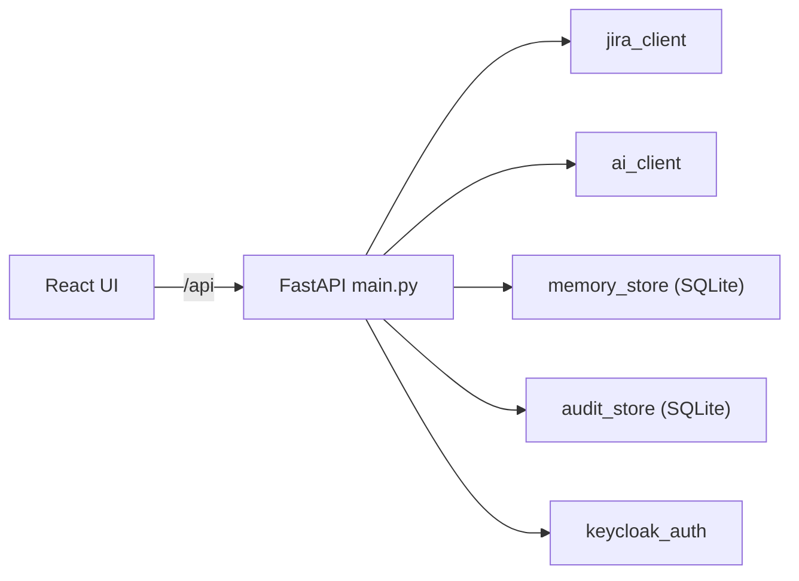

# Test Intellect AI

[](https://www.python.org/)
[](https://fastapi.tiangolo.com/)
[](https://react.dev/)
[](https://vitejs.dev/)
[](https://sqlite.org/)  
[](https://www.atlassian.com/software/jira)
[](https://platform.openai.com/docs/api-reference)
[](https://www.keycloak.org/)

<p align="center">
  <video controls playsinline width="880" preload="metadata">
    <source src="resources/video.mp4" type="video/mp4" />
  </video>
</p>

Web app that pulls **JIRA** requirements (or pasted text), calls an **OpenAI-compatible** LLM (**local** or **cloud**) to generate **Gherkin-style test cases**. 

Configure the model with **`LLM_URL`** (base URL including `/v1`) and optional **`LLM_ACCESS_TOKEN`** for providers that require a **Bearer API key**. 

Optionally **saves** runs per ticket in **SQLite**, and records actions in an **audit log**. 

Optional **Keycloak** sign-in ties users to audit entries.

---

### Architecture



---

## Features

### Requirements

- **JIRA mode:** Fetch a ticket’s summary and description. The API normalizes Atlassian Document Format, wiki markup, and rendered HTML into plain text for the model.
- **Paste mode:** Generate tests from pasted plain text or Markdown without JIRA credentials.

### AI Test Generation

- **Local / Cloud Models:** Any OpenAI-compatible **`POST …/v1/chat/completions`** endpoint.
  - **Local:** e.g. **LM Studio** on `http://127.0.0.1:1234/v1`.
  - **Cloud:** e.g. **OpenAI**, **Azure OpenAI**, or other hosts with the same API shape—set **`LLM_URL`** to that base URL and **`LLM_ACCESS_TOKEN`** to your **API token** (sent as `Authorization: Bearer …`).
  - Leave **`LLM_ACCESS_TOKEN`** empty for typical local servers (a placeholder bearer is used where the server ignores auth).
- **Structured Output:** Scenarios with steps (Gherkin-style); configurable **minimum** and **maximum** test cases per run (`max_test_cases = 0` means no upper limit).
- **Priorities in Generated Tests:** In **paste mode**, allowed priority labels come from **`PASTE_MODE_PRIORITIES`** in `.env`. In **JIRA mode**, generation can use your project’s **JIRA priority names** (loaded for the run) so labels stay aligned with what you can map and push.

### History & Comparison

- **Per-Ticket Storage:** SQLite keeps the latest requirements and generated tests per ticket (when saving is enabled).
- **Similar Ticket Matching:** If there is no exact saved row for a key, optional **similar title + description** matching via **`MEMORY_SIMILARITY_THRESHOLD`** in `.env` (`0` = off; try ~`0.88`–`0.95`).
- **History UI:** List saved tickets, filter by ticket id, open a detail view with full requirements and tests.
- **Requirements Diffs:** When you regenerate with prior saved data for the **same requirement ticket**, the UI can show a **requirements diff** and **change status** tags on test cases (e.g. new / updated / unchanged).

### JIRA Integration

- **Fetch & generate:** Load requirements from JIRA, then generate test cases in-app (same ticket flow as above).
- **Push to JIRA:** Create **new** test issues in a configurable **test project** and **issue type**, or **update** an existing test issue when an issue key is already linked.
  - **Link to Requirement:** The API creates an **issue link** between the new/updated test issue and the requirement ticket (**POST**-style link on the server using inward/outward issue keys). Default link type name is **`Relates`** (must match **Project → Issue linking** in Jira); override with **`JIRA_TEST_LINK_TYPE`**.
  - **Link Direction:** **`JIRA_LINK_INWARD_IS_REQUIREMENT`** (`true`/`false`) controls which side of the link is the requirement vs the test—swap if your site expects the opposite.
  - **Defaults From `.env`:** **`JIRA_TEST_PROJECT_KEY`**, **`JIRA_TEST_ISSUE_TYPE`**, **`JIRA_TEST_LINK_TYPE`** (also overridable per request from the UI where supported).
  - **UI:** Shows a **link** to the Jira issue when a test is pushed, and **create vs update** affordances (e.g. update when the scenario already has a linked issue).
- **Bulk Push:** Push **filtered** test rows (e.g. by change-status chips: All, Unchanged, Updated, New) using the **same rules** as per-row push; the UI uses a **confirmation-style** control before running the bulk operation.
- **Priorities:** Optional alignment with Jira—**`POST /api/jira/priorities`** returns priority **names** and **icon URLs**; the **+** flow can map AI priorities to Jira after the test project is set (see **Notes**).

### Audit & export

- **Audit Log:** Records fetch, generate, login/logout, and related actions. With Keycloak enabled, entries include **username**.
- **Filters:** Filter audit rows by user, ticket, and action.
- **PDF Export:** Download full or filtered audit records as a PDF.

### Authentication & Modes

- **Keycloak OIDC (Optional):** Login for API and UI; idle-timeout hints in the UI.
- **Mock Mode (Development Only):** No real JIRA HTTP; built-in sample requirements; 
  - No audit persistence from generate.
  - No history saves from generate.

### User Experience

- **Light / Dark Theme:** Toggle in the header.
- **Copy as Markdown:** Copy requirements and test cases where supported.
- **Accessibility:** Skip link to main content; `aria-live` announcements for key actions.
- **Help Tooltips:** Shared **FloatingTooltip** (React portal + positioned near the anchor) so help text is not clipped inside modals or the sidebar; avoids relying on slow native `title` tooltips for primary actions.
- **JIRA Actions:** Per-row and bulk controls use the same tooltip pattern for short status text (e.g. “Added to JIRA as …”) without extra empty padding on one-line hints.
- **Form Layout:** In **JIRA mode**, **minimum / maximum test cases** sit with the main JIRA form (e.g. near password). In **paste mode**, min/max stay **below** the requirements block.

---

<details>
<summary><strong>Environment</strong> (<code>.env</code>)</summary>

1. Copy the example file to the **repository root**:

   ```bash
   cp .env.example .env
   ```

2. Configure at least:

   - **JIRA:** For real Jira calls, set **`JIRA_URL`**, **`JIRA_USERNAME`**, **`JIRA_PASSWORD`** (API token is common on Atlassian Cloud). Defaults for the UI also use:
     - **`JIRA_TEST_PROJECT_KEY`** — project where new test issues are created.
     - **`JIRA_TEST_ISSUE_TYPE`** — e.g. `Test` (must exist in that project).
     - **`JIRA_TEST_LINK_TYPE`** — exact link type name (often **`Relates`**).
     - **`JIRA_LINK_INWARD_IS_REQUIREMENT`** — `true`/`false` to match how your site expects requirement vs test on the link.
     - **`JIRA_VERIFY_SSL=false`** only for self-signed TLS (insecure).
   - **Mock (Development Only):** `MOCK=true` disables real JIRA calls and history saves from generate.
   - **UI:** `SHOW_MEMORY_UI`, `SHOW_AUDIT_UI` toggle the History sidebar and Audit panel (defaults `true`).
   - **History Matching:** **`MEMORY_SIMILARITY_THRESHOLD`** — similar-ticket match when the exact key is missing (`0` = off).
   - **Priorities (labels):** **`PASTE_MODE_PRIORITIES`** — comma-separated list for paste-mode generation.
   - **Keycloak (Optional)** — `USE_KEYCLOAK=true` plus `KEYCLOAK_URL`, `KEYCLOAK_REALM`, `KEYCLOAK_CLIENT_ID` (public client; redirect URI = your app origin, e.g. `http://localhost:5173/*` for Vite or `http://localhost:8001/*` with Docker). `KEYCLOAK_IDLE_TIMEOUT_MINUTES` (default `5`).
   - **Docker + Keycloak:** Use a `KEYCLOAK_URL` the **browser** can reach. For local dev you can omit `KEYCLOAK_INTERNAL_URL`; with `docker compose`, [docker-compose.yml](docker-compose.yml) may inject it for the API container.
   - **LLM:** 
     - `LLM_URL` is the OpenAI-compatible API base (must include `/v1`), e.g. `http://127.0.0.1:1234/v1` for LM Studio or `https://api.openai.com/v1` for OpenAI. 
     - Set **`LLM_MODEL`** to the provider’s model id. **`LLM_ACCESS_TOKEN`** — API key for cloud providers; omit or leave empty for local LM Studio–style servers.

The backend reads the root `.env`. **`GET /api/config`** exposes safe **defaults** for the UI (Jira URL, username, test project key, issue type, link type, mock/UI/Keycloak flags)—**never** the Jira password or LLM token.

</details>

---

<details>
<summary><strong>Run locally</strong></summary>

**Backend (Python 3.10+):**

```bash
cd backend
python3.12 -m venv .venv
source .venv/bin/activate   # Windows: .venv\Scripts\activate
pip install -r requirements.txt
uvicorn main:app --reload --host 127.0.0.1 --port 8001
```

**Frontend (Node 18+):**

```bash
cd frontend
npm install
npm run dev
```

Open **http://127.0.0.1:5173** (Vite). The dev server proxies `/api` to the backend on port **8000**. Start a local LLM server (e.g. **LM Studio**) or point **`LLM_URL`** / **`LLM_ACCESS_TOKEN`** at a cloud API; with **`MOCK=true`**, dummy JIRA fields are fine.

</details>

---

<details>
<summary><strong>Docker Compose</strong></summary>

1. `docker build -t test-intellect-ai:1.0 .`
2. Point [docker-compose.yml](docker-compose.yml) at that image.
3. `docker compose up`
4. UI will be accessible at `http://127.0.0.1:8001`

The compose file can override **`LLM_URL`** to **`http://host.docker.internal:1234/v1`** so the API container reaches **LM Studio** on the host (container `127.0.0.1` is not the host). For a **cloud** endpoint, set **`LLM_URL`** to the HTTPS API base instead; adjust port or **`DOCKER_LLM_URL`** if needed.

### Keycloak and Docker

- Enable login with **`USE_KEYCLOAK=true`** in **`.env`**. The backend only reads that exact name (`USE_KEYCLOAK`); a variable named **`KEYCLOAK`** alone is ignored. If you copied **`.env.example`**, it sets **`USE_KEYCLOAK=false`**, which turns Keycloak off even when you expect it on—set **`USE_KEYCLOAK=true`**.
- With **`USE_KEYCLOAK=true`**, **`KEYCLOAK_URL`**, **`KEYCLOAK_REALM`**, and **`KEYCLOAK_CLIENT_ID`** must be non-empty or the API will fail at startup. **`KEYCLOAK_INTERNAL_URL`** is for token verification from inside the container (compose defaults it to **`http://host.docker.internal:8080`** when Keycloak runs on the host).
- In Keycloak, add **Valid redirect URIs** for the app (e.g. **`http://localhost:8001/*`** when using Compose on port 8001).

</details>

---

<details>
<summary><strong>API overview</strong></summary>

| Method | Path | Description |
|--------|------|---------------|
| `GET` | `/api/config` | Defaults for the UI: `default_jira_url`, `default_username`, `default_jira_test_project_key`, `default_jira_test_issue_type`, `default_jira_link_type`, `mock`, `show_memory_ui`, `show_audit_ui`, `use_keycloak`, Keycloak client fields, `keycloak_idle_timeout_minutes` (no secrets). |
| `GET` | `/api/memory/list` | List saved entries per ticket. With Keycloak, send `Authorization: Bearer <token>`. |
| `GET` | `/api/memory/item/{ticket_id}` | Saved `requirements` and `test_cases` for a ticket. |
| `POST` | `/api/memory/update-test-cases` | Persist updated test cases to history for a ticket. |
| `POST` | `/api/memory/save-after-edit` | Save requirements + tests after edit; optional audit of edited Jira issue key. |
| `GET` | `/api/audit/list` | Audit rows (`created_at`, `username`, `ticket_id`, `action`). |
| `POST` | `/api/audit/auth` | Record login/logout when Keycloak is enabled. |
| `POST` | `/api/fetch-ticket` | Body: `jira_url`, `username`, `password`, `ticket_id` → `requirements`. |
| `POST` | `/api/generate-tests` | Fetch + generate; `save_memory`, `min_test_cases`, `max_test_cases`; optional diff and `had_previous_memory`. |
| `POST` | `/api/generate-from-paste` | Paste flow: `description`, optional `title`, optional `memory_key`. |
| `POST` | `/api/jira/priorities` | Returns Jira priorities with **name** and **iconUrl** for mapping AI labels to Jira. |
| `POST` | `/api/jira/push-test-case` | Create or update a test issue and link it to the requirement (see `backend/main.py` / `jira_client.py` for bodies). |

Other routes and request schemas: see **`backend/main.py`**.

</details>

---

## Notes

- **Mock Mode:** No audit writes from generate; no history saves from generate. Audit user column is empty without Keycloak.
- **JIRA Test Project:** After generating tests, configuring the test project and using **+** can pull priorities from JIRA depending on setup.

---

## Tested with a local model

Development testing has used a local OpenAI-compatible endpoint (e.g. LM Studio on `http://127.0.0.1:1234/v1`) with:

- **`qwen/qwen3-coder-30b`**
---

## Future Improvements & Features

- Agentic feature to validate created test cases
- RAG feature
- Automation