# Test Intellect AI

[](https://www.python.org/)
[](https://fastapi.tiangolo.com/)
[](https://react.dev/)
[](https://vitejs.dev/)
[](https://sqlite.org/) [](https://www.atlassian.com/software/jira)
[](https://platform.openai.com/docs/api-reference)
[](https://www.keycloak.org/)

Web app that pulls JIRA requirements (or paste text), uses OpenAI-compatible APIs to generate Gherkin-style test cases,
push to JIRA, and run UI/API automation.

Optionally:

- Save runs per ticket in SQLite 
- Track actions in an audit log 
- Use Keycloak to associate users with activity

---

### Product Sample Video

<p align="center">
  <a href="https://youtu.be/MCDQR60AEiE">
    
  </a>
</p>

---

### Product Sample Images and Report

<details>
<summary><strong>Images</strong></summary>

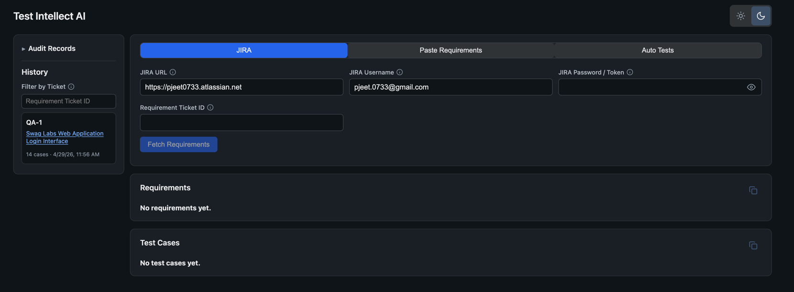
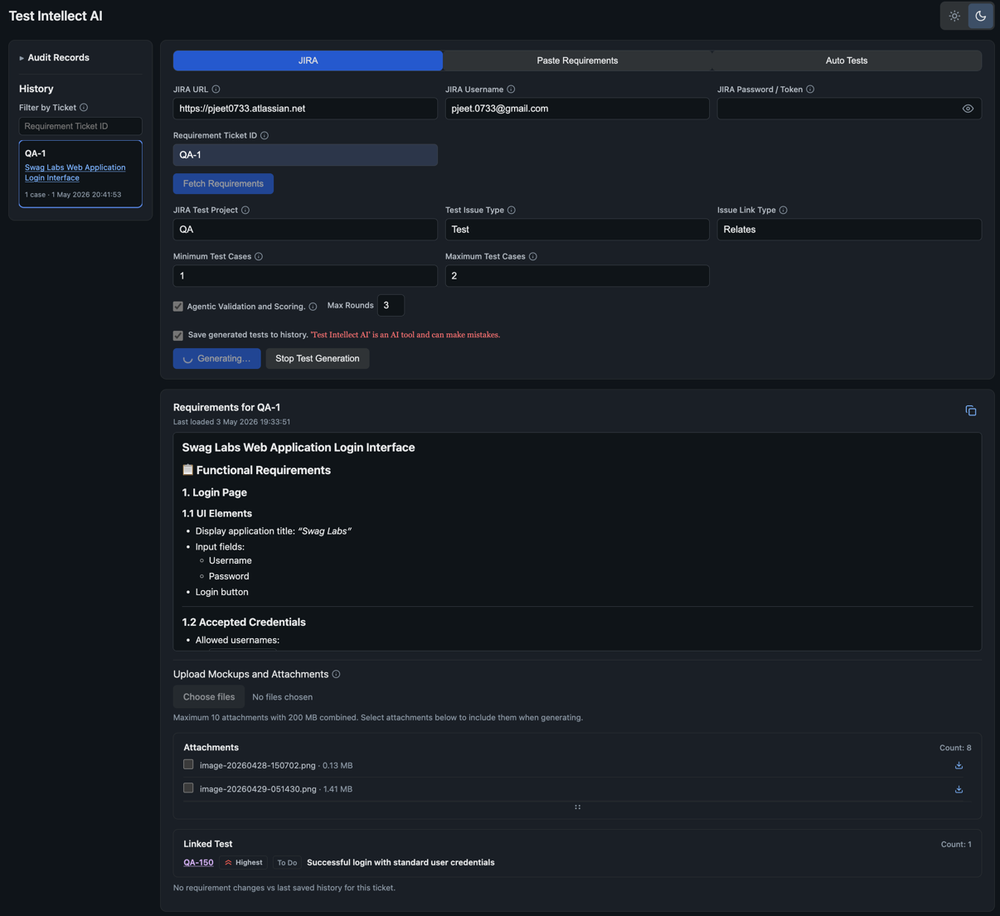
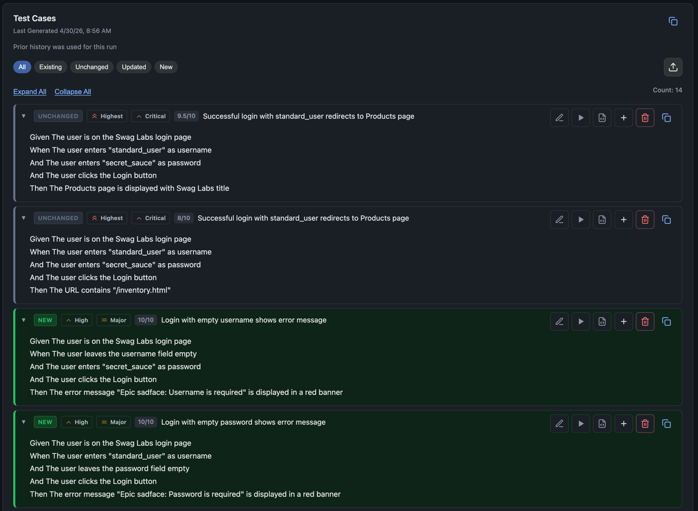
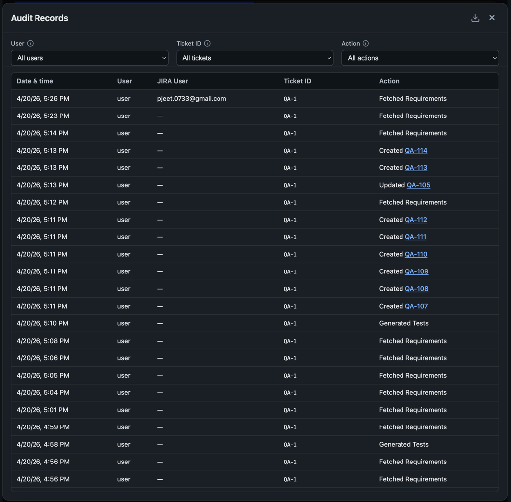
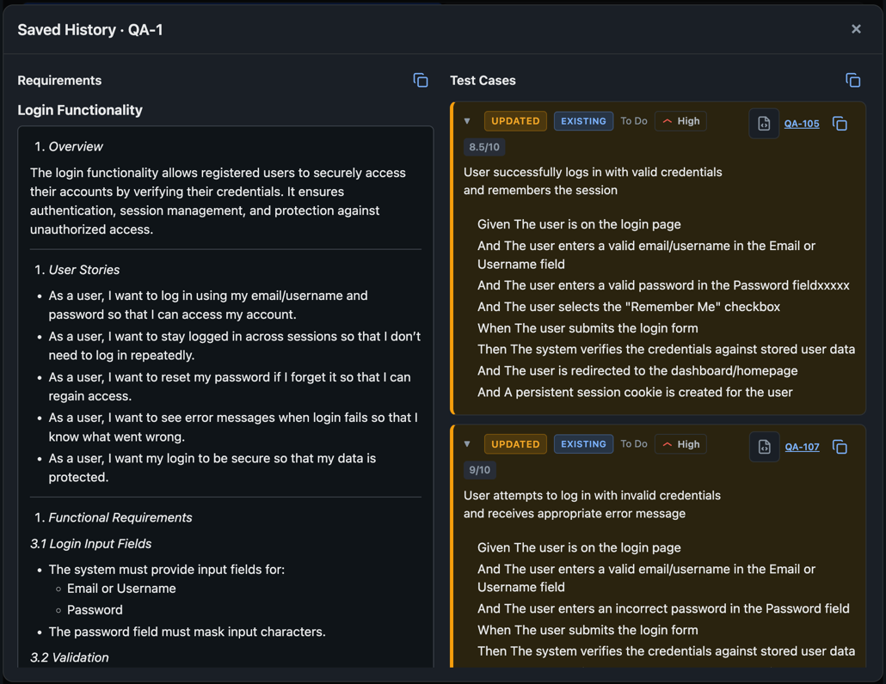

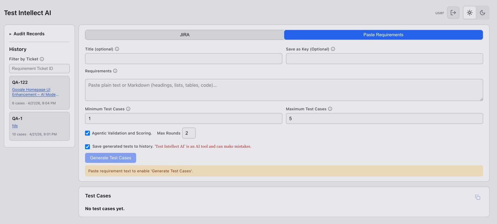
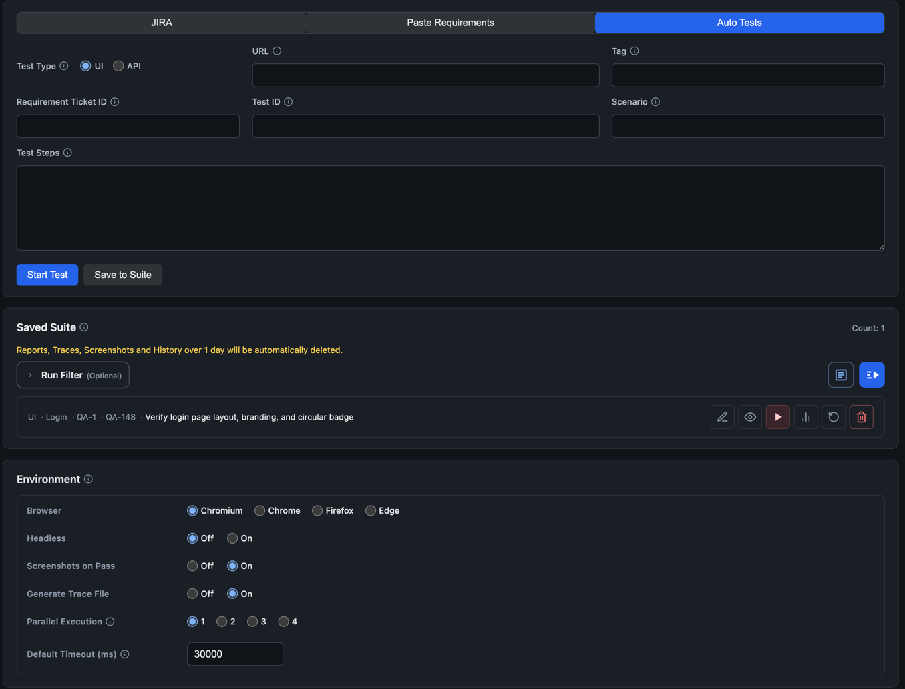
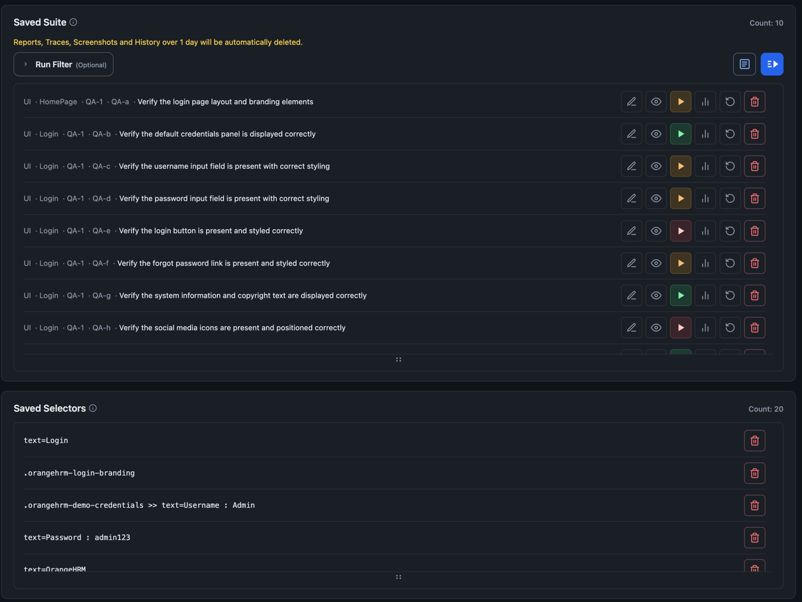
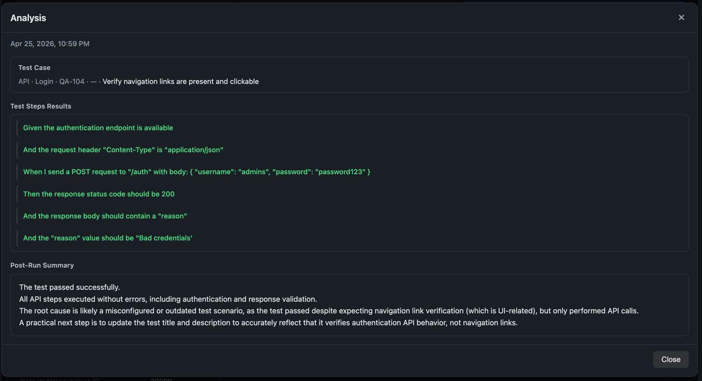
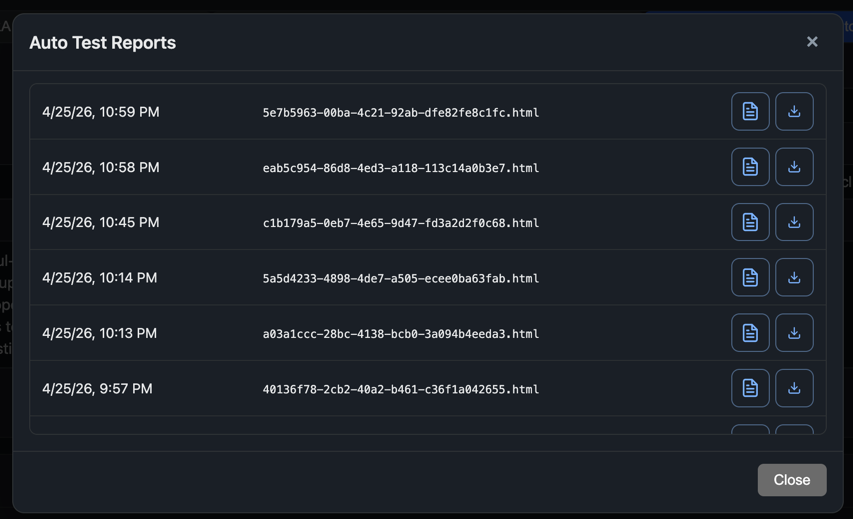
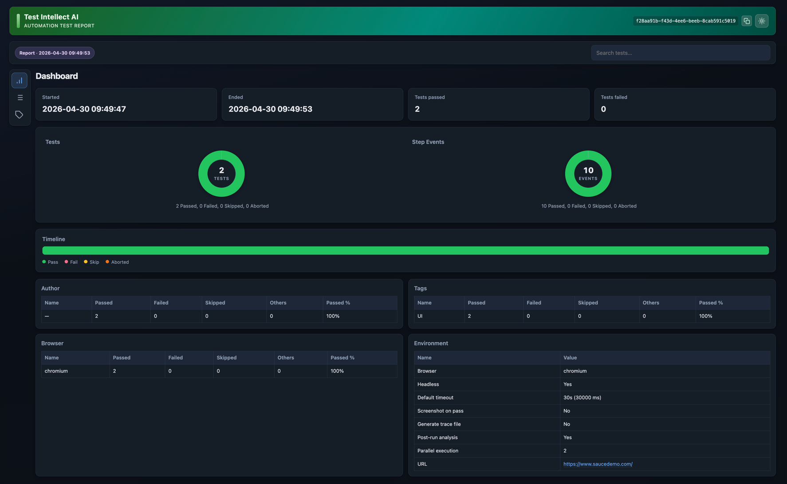


</details>

[Sample Automation Test Report](resources/product-sample/sample-automation-report.html)

[Sample Audit Records](resources/product-sample/sample-audit-records.pdf)

---

### Architecture

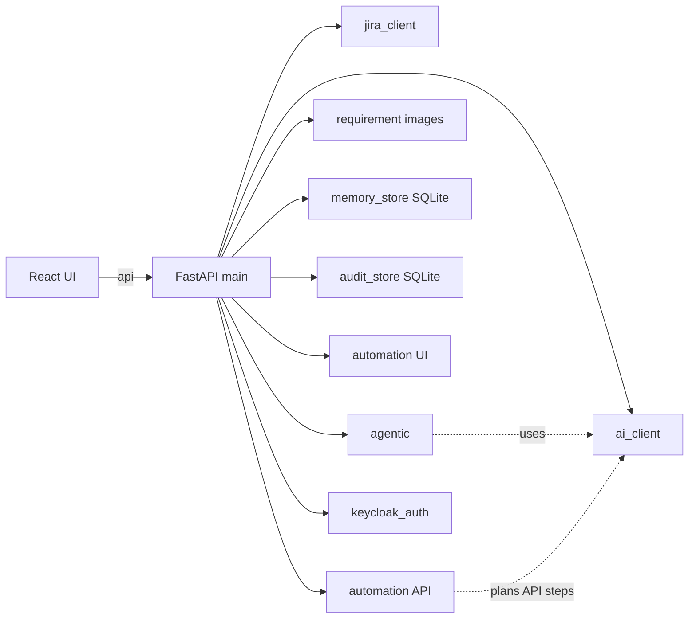

---

## Functionality Flowcharts

<details>
<summary><strong>JIRA Mode</strong></summary>

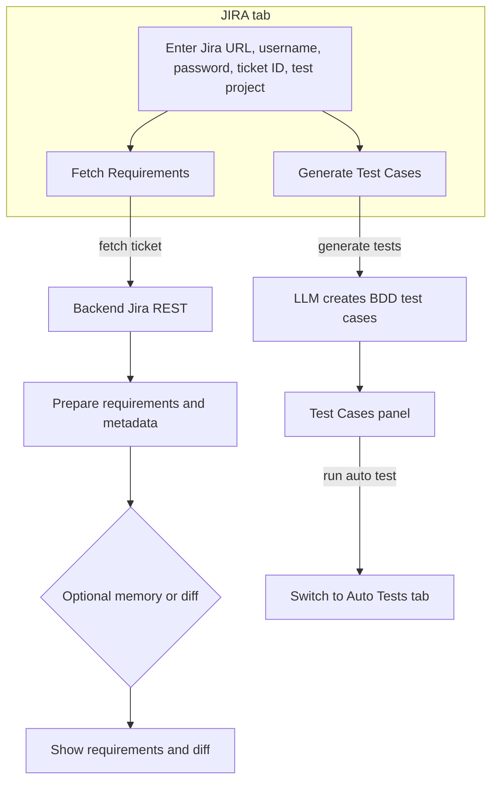

</details>

<details>
<summary><strong>Paste Requirements</strong></summary>

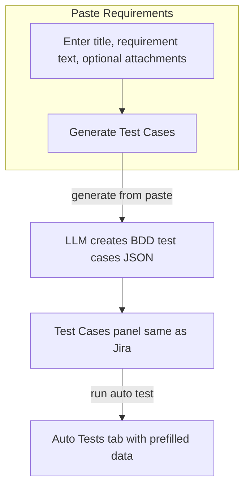

</details>

<details>
<summary><strong>Auto Test (Suite Run)</strong></summary>

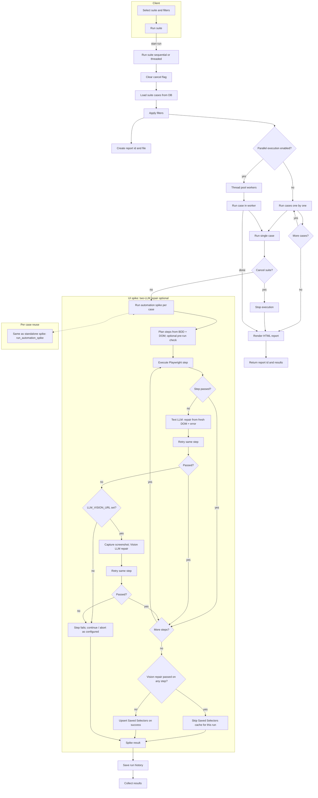

</details>

<details>
<summary><strong>Auto Test (Single Run)</strong></summary>

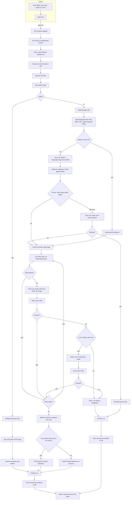

</details>

---

## Features

### Modes (toggle via `.env`)

- **JIRA:** Fetch ticket (ADF/wiki/HTML → text).
- **Paste Requirements:** Generate from text/Markdown, no JIRA.
- **Auto Tests:** BDD browser runs, saved suite, reports.

### AI test generation

- Any OpenAI-compatible `/v1/chat/completions` (local e.g. LM Studio, or cloud).
- **Vision:** optional requirement mockups/images to the model (enable in `.env`; use a vision-capable model).
- Structured Gherkin scenarios, configurable **min/max** test case count (`0` = no max).
- **Priorities:** JIRA project priorities, or `PASTE_MODE_PRIORITIES` for paste mode.
- **Scoring:** Model scores each case (/10). **Edit/delete** generated cases; delete is limited when a case has a JIRA
  id (see UI).
- **Automation Skeleton:** Generate code-style skeleton per case.
- **Agentic:** Two-step validate-and-refine pipeline.

### Auto test execution (UI and API)

- **Saved Suite:** Store cases; run one / run all; optional **tag** and **JIRA** filters; configurable **parallel**
  runs; env (browser, headless, timeout, trace, screenshot-on-pass, post-run analysis, HTML reports, retention of
  artifacts).
- **Execution history** per saved case; **HTML reports** for runs (start test and suite; retention prunes old data per
  `AUTOMATION_RETENTION_DAYS`, default 20).
- **Saved History** (memory dialog): open a ticket snapshot; **Run** a case into the Auto test form (prefills
  requirement + test ids).
- Running case indicated in the UI; suite analysis text refers to **last run** from the saved suite when applicable.

### History & comparison

- SQLite stores latest requirements + tests per ticket when saving is on.
- **Similar match:** if no exact key, optional fuzzy match via `MEMORY_SIMILARITY_THRESHOLD` (`0` = off).
- **History sidebar:** list/filter by requirement id; open **Saved History** for full snapshot.
- **Regenerate** with prior memory: **requirements diff** and **change status** on cases (new / updated / unchanged /
  existing).

### JIRA

- Fetch issue, **linked** work and **linked** tests, attachments.
- **Push** test issues (create/update), **link** to requirement (`JIRA_TEST_LINK_TYPE`, e.g. Relates; direction via
  `JIRA_LINK_INWARD_IS_REQUIREMENT`).
- **Bulk push** (e.g. by change filter), priority names/icons mapped from JIRA.
- `JIRA_LINKED_WORK_ISSUE_TYPES` filters which linked types appear (see `.env`).

### Audit

- Logged actions (fetch, generate, JIRA push, **Auto Test suite** save/update/delete, etc.); filter; **export as PDF**
  (UI). **Ticket ID** in the list can link to JIRA when a site URL is set and the value looks like an issue key.

### Auth & dev

- **Keycloak** OIDC optional for UI/API; idle timeout hint in UI.
- **Mock (`MOCK=true`):** no real JIRA HTTP, fixture text; no audit on generate or on suite save/update/delete; no memory
  save on generate.

### UX

- Light/dark theme, copy as Markdown, tooltips, skip links and live regions for accessibility.

---

<details>
<summary><strong>Environment</strong></summary>

1. `cp .env.example .env` (repo root). See [resources/env-variables.md](resources/env-variables.md) for a full list.

2. **Minimum (non-mock):** `LLM_TEXT_URL` + `LLM_TEXT_MODEL` (+ `LLM_TEXT_ACCESS_TOKEN` if your provider needs it). Add
   `LLM_VISION_*` only if you want image/PDF in the model and the upload UI. **Mock:** `MOCK=true` for JIRA-free dev
   (JIRA can be dummy values).

3. **UI flags:** `SHOW_MEMORY_UI`, `SHOW_AUDIT_UI`, `SHOW_JIRA_MODE_UI`, `SHOW_PASTE_REQUIREMENTS_MODE_UI`,
   `SHOW_AUTO_TESTS_UI` — at least one requirement-related mode must stay on (defaults ensure this).

4. **Keycloak (optional):** `USE_KEYCLOAK=true` and realm/client/URLs; for Docker, browser-reachable `KEYCLOAK_URL` and
   often `KEYCLOAK_INTERNAL_URL` for the API. Redirect URIs in Keycloak must match the app origin/port.

5. `GET /api/config` returns **safe defaults** for the UI (no passwords or LLM secrets).

</details>

---

<details>
<summary><strong>Run locally</strong></summary>

**Backend (Python 3.10+):**

```bash
cd backend
python3.12 -m venv .venv
source .venv/bin/activate   # Windows: .venv\Scripts\activate
pip install -r requirements.txt
uvicorn main:app --reload --host 127.0.0.1 --port 8001
```

**Frontend (Node 18+):**

```bash
cd frontend
npm install
npm run dev
```

Open **http://127.0.0.1:5173** (Vite). Proxies `/api` → `http://127.0.0.1:8001` (see `frontend/vite.config.js`). Use a
local LLM or cloud API; with **`MOCK=true`**, JIRA can be dummy values.

</details>

---

<details>
<summary><strong>Docker Compose</strong></summary>

1. `docker build -t test-intellect-ai:1.0 .`
2. Point [docker-compose.yml](docker-compose.yml) at the image, then `docker compose up`
3. UI is typically at `http://127.0.0.1:8001`

Containers often set `LLM_TEXT_URL` → `http://host.docker.internal:...` to reach the host’s LM Studio. `USE_KEYCLOAK` (
not a
lone `KEYCLOAK=` flag) must be `true` to enable Keycloak. See [docker-compose.yml](docker-compose.yml) for
`KEYCLOAK_INTERNAL_URL` defaults.

</details>

---

<details>
<summary><strong>API overview</strong></summary>

| Method   | Path                                | Purpose                                                                                                                           |
|----------|-------------------------------------|-----------------------------------------------------------------------------------------------------------------------------------|
| `GET`    | `/api/config`                       | UI defaults: JIRA defaults, `mock`, feature flags, Keycloak client fields, idle timeout (no secrets).                             |
| `GET`    | `/api/memory/list`                  | Saved tickets list (Keycloak: `Authorization: Bearer`).                                                                           |
| `GET`    | `/api/memory/item/{ticket_id}`      | Saved `requirements` + `test_cases`.                                                                                              |
| `POST`   | `/api/memory/update-test-cases`     | Persist test case list updates.                                                                                                   |
| `POST`   | `/api/memory/save-after-edit`       | Save after edit.                                                                                                                  |
| `GET`    | `/api/audit/list`                   | Audit rows.                                                                                                                       |
| `POST`   | `/api/audit/auth`                   | Login/logout (Keycloak).                                                                                                          |
| `POST`   | `/api/fetch-ticket`                 | JIRA issue → `requirements`.                                                                                                      |
| `POST`   | `/api/generate-tests`               | JIRA path: generate, optional memory diff, save flags, min/max cases.                                                             |
| `POST`   | `/api/generate-from-paste`          | Paste path: `description`, optional `title`, `memory_key`.                                                                        |
| `POST`   | `/api/jira/priorities`              | JIRA priorities (names + icon URLs).                                                                                              |
| `POST`   | `/api/jira/push-test-case`          | Create/update test + link.                                                                                                        |
| `POST`   | `/api/generate-automation-skeleton` | LLM automation code skeleton for a test case.                                                                                     |
| `POST`   | `/api/automation/suite`             | Add a saved Auto Test case. With Keycloak, requires `Authorization: Bearer`; on success, writes **audit** (not when `MOCK=true`). |
| `PUT`    | `/api/automation/suite/{case_id}`   | Update a saved case. Same auth and **audit** rules as `POST` suite.                                                               |
| `DELETE` | `/api/automation/suite/{case_id}`   | Remove a saved case. Same auth and **audit** rules as `POST` suite.                                                               |

**Automation** (other paths): list suite, run spike, stop, suite batch run, reports, artifacts, selectors, etc. — see
`backend/automation/routes.py` (all under `/api/automation/...`).

</details>

---

## Notes

- **Mock Mode:** No audit writes from generate or from suite save/update/delete; no history saves from generate. Audit
  user column is empty without Keycloak
- **JIRA Test Project:** After generating tests, configuring the test project and using **+** can pull priorities from
  JIRA depending on setup
- Make sure to use model that supports vision in order to use feature to pass mockups to LLM
- Analysis for each test case will have details of last execution only if executed from 'Saved Suite'
- Green dot will appear for the currently running test case
- View Report will show the report from 'Start Test' as well
- 'Run Test Case' button will be enabled when `SHOW_AUTO_TESTS_UI=true`
- System will keep automation artifacts for last 20 days
- If `LLM_VISION_URL` is not set, the **Upload mockups** UI and the **include attachment** checkboxes for generation are
  hidden; JIRA can still list ticket attachments. See [resources/env-variables.md](resources/env-variables.md) for
  details.
- If a step is passed using screenshot from Vision model then the record will not be saved in 'Saved Selectors'
- JIRA will fetch the template of Test Project each `JIRA_CREATEMETA_TEST_TTL_SECONDS`

---

## Tested with a local model

Development testing has used a local OpenAI-compatible endpoint (e.g. LM Studio on `http://127.0.0.1:1234/v1`) with:

- qwen/qwen3-coder-30b
- qwen/qwen3-coder-next
- openai/gpt-oss-20b
- openai/gpt-oss-120b
- qwen/qwen3-vl-30b (model with vision support)

---

## Future Improvements & Features

- Use a linked issue to get knowledge of the Requirement ticket
- Choice to generate test cases based on BDD or something else
- RAG feature
- Link with QA test framework and DEV code

## Last

- Use TSX instead of JSX for frontend 
- Provide a dropdown to select models or type model ID
- Use a multi-model approach for Test Generation, coding, and vision
