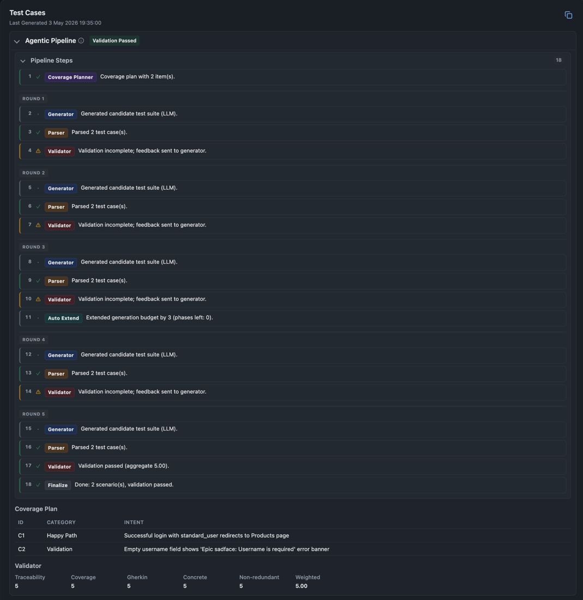
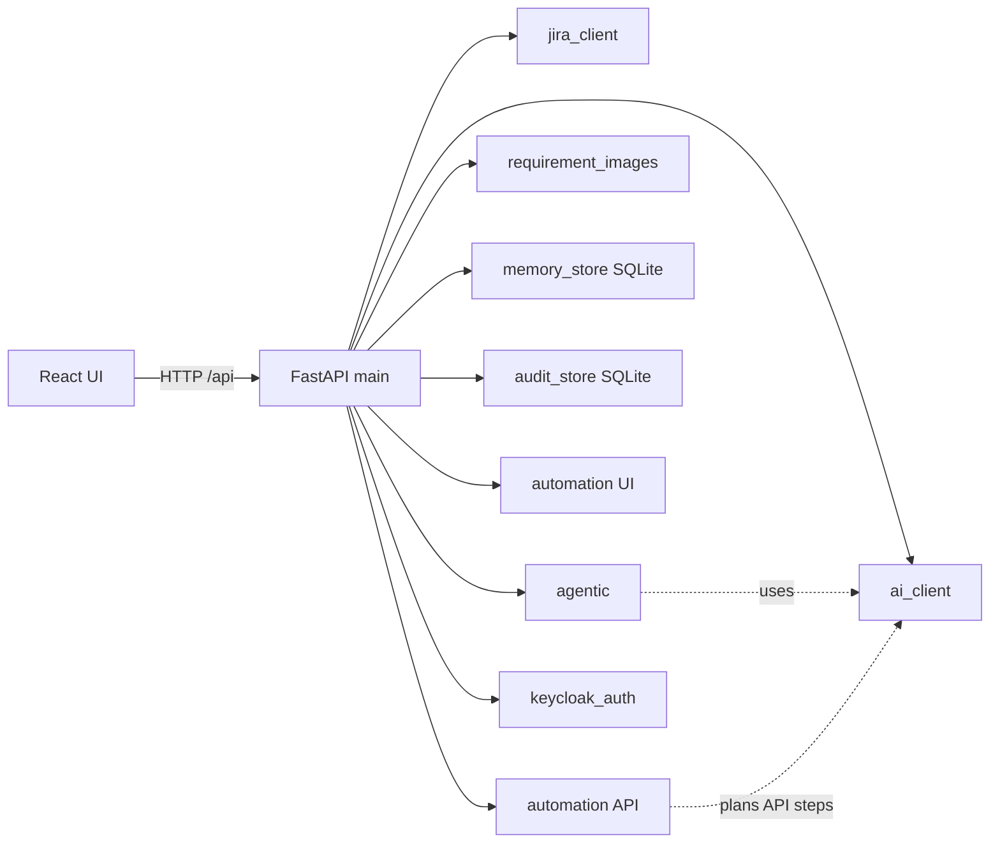
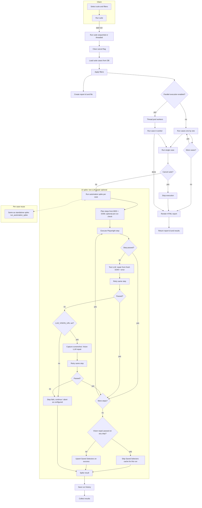
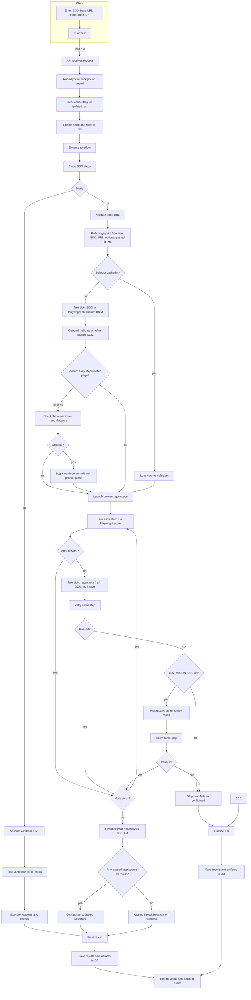
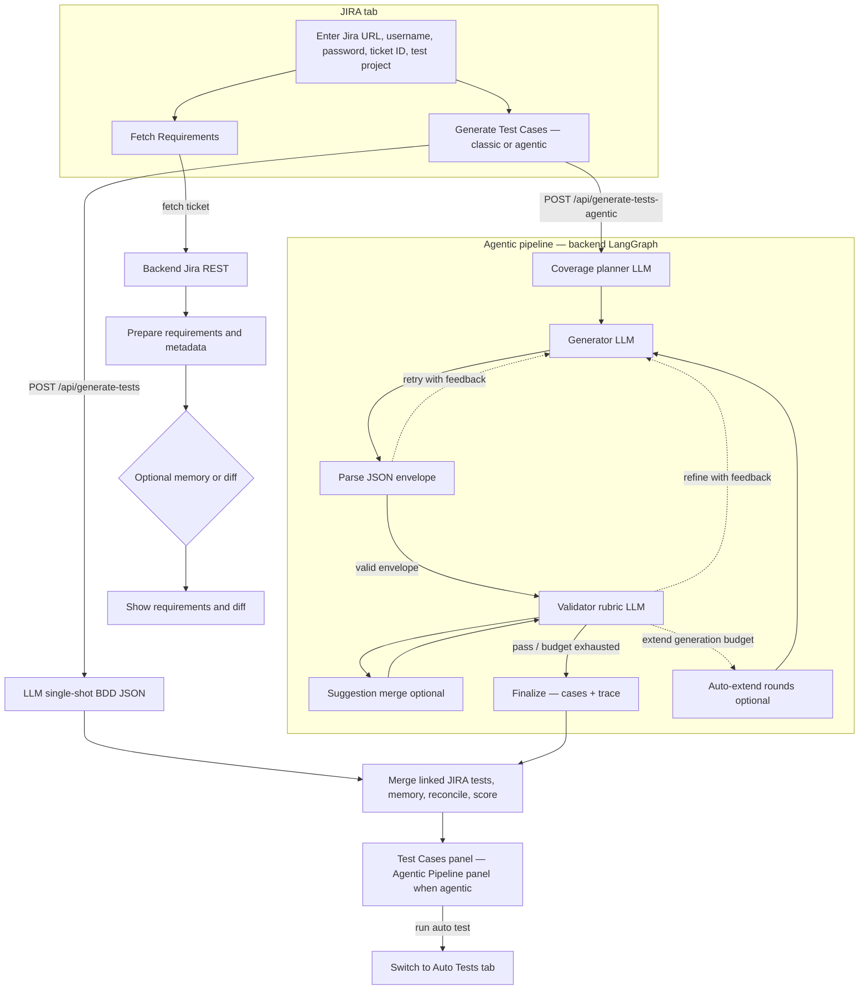
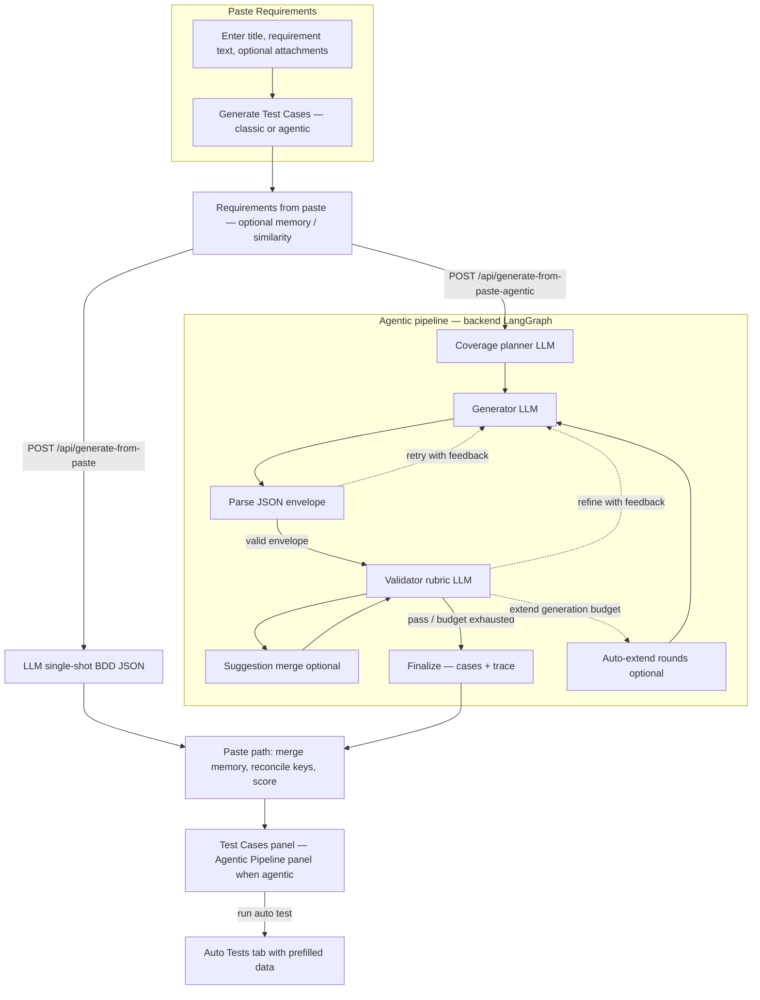

# Test Intellect AI

[](https://www.python.org/)
[](https://fastapi.tiangolo.com/)
[](https://react.dev/)
[](https://vitejs.dev/)
[](https://sqlite.org/) [](https://www.atlassian.com/software/jira)
[](https://platform.openai.com/docs/api-reference)
[](https://www.keycloak.org/)

Web app that ingests requirements from Jira or free-form text, generates Gherkin-style test cases via OpenAI-compatible
APIs, writes them back to Jira, and runs UI and API automation.

Optionally:

- Save runs per ticket in SQLite
- Track actions in an audit log
- Use Keycloak to associate users with activity

---

### Product Sample Video

<p align="center">
  <a href="https://youtu.be/MCDQR60AEiE">
    
  </a>
</p>

---

### Product Sample Images and Report

<details>
<summary><strong>Images</strong></summary>





</details>

[Sample Automation Test Report](resources/product-sample/sample-automation-report.html)

[Sample Audit Records](resources/product-sample/sample-audit-records.pdf)

---

### Architecture



---

## Functionality Flowcharts

<details>
<summary><strong>Auto Test (Suite Run)</strong></summary>



</details>


<details>
<summary><strong>Auto Test (Single Run)</strong></summary>



</details>

<details>
<summary><strong>JIRA Mode</strong></summary>



</details>


<details>
<summary><strong>Paste Requirements</strong></summary>



</details>


---

## Features

### Modes (toggle via `.env`)

- **Auto Tests**: Run BDD-style browser and API automation, persist suites, and produce reports.
- **Jira**: Load a ticket and convert ADF/wiki/HTML to plain text for generation.
- **Paste Requirements**: Generate from pasted text or Markdown without Jira.

### AI Test Generation

- **LLM backend**: Any OpenAI-compatible /v1/chat/completions endpoint (local, e.g. LM Studio, or cloud).
- **Vision (optional)**: Send requirement mockups or images when enabled in .env; use a vision-capable model.
- **Output**: Structured Gherkin scenarios with configurable min/max case counts in [App.jsx](frontend/src/App.jsx).
- **Priorities**: Jira project priority list in Jira mode, or PASTE_MODE_PRIORITIES in paste mode.
- **Scoring**: The model assigns a score (/10) per case. Edit or delete generated cases; deletes are restricted when a
  case is linked to Jira (see UI).
- **Automation Skeleton**: Per-case code-style automation skeleton generation.
- **Agentic**: LangGraph flow — coverage planning → generation → parsing → validator scoring → optional suggestion
  merge — with retries and auto-extend rounds. Exposed as /api/generate-tests-agentic (mirrored for paste mode).

### Auto Test Execution (UI and API)

- **Saved Suite**: Persist scenarios; run one or run all. Optional filters by tags or Jira. Parallel run count is
  configurable. Environment: browser profile, headless, timeouts, traces, screenshots on pass, HTML reports, and
  artifact/report retention.
- **Run History**: Per saved case; HTML reports for individual runs and full suite runs. `AUTOMATION_RETENTION_DAYS`
  prunes old runs/data (default 20).
- **Saved History (memory)**: Open a ticket snapshot; Run routes a case into the Auto Tests form with requirement + test
  issue ids prefilled.
- **UI Feedback**: Shows which case is executing. Suite analysis text uses the last run of the saved suite when that
  applies.

### History & Comparison

- **Persistence**: With saving enabled, SQLite keeps the latest requirements and linked tests per ticket.
- **Similar Match**: If there is no exact key, optionally match a prior row using MEMORY_SIMILARITY_THRESHOLD (fuzzy on
  title/description); set to 0 to disable.
- **History Sidebar**: Browse and filter by requirement id; open Saved History for the full stored snapshot.
- **Regenerate with Memory**: Reload prior context so the UI can show a requirements diff and per-case change status (
  e.g. new, updated, unchanged, existing).

### JIRA Integration

- **Read:** Fetch the requirement issue, **linked work** and **linked tests**, and attachments.
- **Write:** Create or update **test** issues and **link** them to the requirement (**`JIRA_TEST_LINK_TYPE`**, e.g.
  `Relates`; inward/outward semantics via **`JIRA_LINK_INWARD_IS_REQUIREMENT`**).
- **Bulk push:** e.g. push by **change/status filter** (new/updated); **priorities** use Jira priority names/icons.
- **`JIRA_LINKED_WORK_ISSUE_TYPES`:** Limits which linked-work types show in the UI (comma-separated list in `.env`).

### Audit

- **Events:** Logs operations such as fetch, generation, **Jira** push, and **saved Auto Test suite**
  create/update/delete (and similar actions).
- **Use:** Filter in-app; **export to PDF** from the UI.
- **Issue keys:** Rows show a **ticket/issue id**; when **Jira site URL** is configured and the value looks like a *
  *Jira key**, it links out to the issue.

### Auth & development

- **Keycloak:** Optional **OIDC** for the UI and API. The UI shows an **idle timeout** hint from config.
- **Mock mode (`MOCK=true`):** Skips real **Jira** HTTP and uses fixture data. Skips audit for **generation** and for *
  *suite** create/update/delete, and skips **memory persistence on generate**.

### UX

- Light/dark theme, copy as Markdown, tooltips, skip links and live regions for accessibility.

---

<details>
<summary><strong>Environment</strong></summary>

1. `cp .env.example .env`. See [resources/env-variables.md](resources/env-variables.md) for a full list.

2. **Minimum (non-mock):** `LLM_TEXT_URL` + `LLM_TEXT_MODEL` (+ `LLM_TEXT_ACCESS_TOKEN` if your provider needs it). Add
   `LLM_VISION_*` only if you want image/PDF in the model and the upload UI.
3. **Mock:** `MOCK=true` for JIRA-free DEV (JIRA can be dummy values).

4. **UI flags:** Set at-least one
    - `SHOW_MEMORY_UI`
    - `SHOW_AUDIT_UI`
    - `SHOW_AUTO_TESTS_UI`
    - `SHOW_JIRA_MODE_UI`
    - `SHOW_PASTE_REQUIREMENTS_MODE_UI`

5. **Keycloak (optional):** `USE_KEYCLOAK=true` and realm/client/URLs; for Docker, browser-reachable `KEYCLOAK_URL` and
   often `KEYCLOAK_INTERNAL_URL` for the API. Redirect URIs in Keycloak must match the app origin/port.

</details>

---

<details>
<summary><strong>Run Locally</strong></summary>

**Backend (Python 3.10+):**

```bash
cd backend
python3.12 -m venv .venv
source .venv/bin/activate   # Windows: .venv\Scripts\activate
pip install -r requirements.txt
playwright install chromium
playwright install firefox
playwright install msedge
uvicorn main:app --reload --host 127.0.0.1 --port 8001
```

**Frontend (Node 18+):**

```bash
cd frontend
npm install
npm run dev
```

- Open **http://127.0.0.1:5173**
- Proxies `/api` → `http://127.0.0.1:8001` (see `frontend/vite.config.js`).

</details>

---

<details>
<summary><strong>Docker Compose</strong></summary>

1. `docker compose up`
2. UI is typically at `http://127.0.0.1:8001`

Containers often set `LLM_TEXT_URL` → `http://host.docker.internal:...` to reach the host’s LM Studio. `USE_KEYCLOAK` (
not a
lone `KEYCLOAK=` flag) must be `true` to enable Keycloak. See [docker-compose.yml](docker-compose.yml) for
`KEYCLOAK_INTERNAL_URL` defaults.

</details>

---

<details>
<summary><strong>API Overview</strong></summary>

| Method   | Path                                          | Purpose                                                                                                                                    |
|----------|-----------------------------------------------|--------------------------------------------------------------------------------------------------------------------------------------------|
| `GET`    | `/api/config`                                 | UI defaults: Jira defaults, `mock`, feature flags, Keycloak client fields, idle timeout, automation env hints, vision limits (no secrets). |
| `GET`    | `/api/memory/list`                            | Saved tickets list (Keycloak: `Authorization: Bearer`).                                                                                    |
| `GET`    | `/api/memory/item/{ticket_id}`                | Saved `requirements` + `test_cases`.                                                                                                       |
| `POST`   | `/api/memory/update-test-cases`               | Persist test case list updates.                                                                                                            |
| `POST`   | `/api/memory/merge-test-case`                 | Merge a single edited test case into saved memory for a ticket.                                                                            |
| `POST`   | `/api/memory/save-after-edit`                 | Save after edit.                                                                                                                           |
| `GET`    | `/api/audit/list`                             | Audit rows.                                                                                                                                |
| `POST`   | `/api/audit/auth`                             | Login/logout (Keycloak).                                                                                                                   |
| `POST`   | `/api/fetch-ticket`                           | Jira issue → `requirements`, linked tests/work, attachments meta, optional memory diff.                                                    |
| `POST`   | `/api/generate-tests`                         | Jira path: single-shot generate (multipart/form or JSON); optional images, memory diff, save flags, min/max cases.                         |
| `POST`   | `/api/generate-tests-agentic`                 | Same as `generate-tests` with LangGraph agentic pipeline (`max_rounds`, retries, auto-extend via server env where configured).             |
| `POST`   | `/api/generate-from-paste`                    | Paste path: `description`, optional `title`, `memory_key`; single-shot generation.                                                         |
| `POST`   | `/api/generate-from-paste-agentic`            | Paste path agentic counterpart of `generate-from-paste`.                                                                                   |
| `POST`   | `/api/jira/priorities`                        | Jira priorities (names + icon URLs); optionally severities when a test project key is supplied.                                            |
| `POST`   | `/api/jira/push-test-case`                    | Create/update test + link to requirement.                                                                                                  |
| `POST`   | `/api/jira/attachment-download`               | Stream a Jira attachment by id (ticket + attachment id); not available in mock mode.                                                       |
| `POST`   | `/api/generate-automation-skeleton`           | LLM automation code skeleton for a test case.                                                                                              |
| `GET`    | `/api/automation/env`                         | Current automation env (browser, headless lock, timeouts, trace, parallel, etc.).                                                          |
| `POST`   | `/api/automation/browser`                     | Set stored browser; returns payload like `GET /api/automation/env`.                                                                        |
| `POST`   | `/api/automation/env-options`                 | Set headless (if not server-locked), screenshot-on-pass, trace, default timeout, parallel execution.                                       |
| `POST`   | `/api/automation/cancel`                      | Request stop for current spike or all suite runs (`all_in_suite`).                                                                         |
| `POST`   | `/api/automation/spike-run`                   | Start a single UI or API BDD run (async); Keycloak may set report author.                                                                  |
| `GET`    | `/api/automation/runs/{run_id}`               | Run metadata and step results.                                                                                                             |
| `GET`    | `/api/automation/results/{run_id}`            | Same response as `GET /api/automation/runs/{run_id}`.                                                                                      |
| `GET`    | `/api/automation/artifacts/{run_id}/{name}`   | Serve a run artifact file (images, trace zip, etc.).                                                                                       |
| `GET`    | `/api/automation/selectors`                   | List cached selector rows (optional `limit`).                                                                                              |
| `DELETE` | `/api/automation/selectors/all`               | Clear selector cache; may audit under Keycloak.                                                                                            |
| `DELETE` | `/api/automation/selectors/{rowid}`           | Delete one selector cache row; may audit under Keycloak.                                                                                   |
| `GET`    | `/api/automation/suite`                       | List saved suite cases.                                                                                                                    |
| `GET`    | `/api/automation/suite/{case_id}/run-history` | Per-case execution history rows.                                                                                                           |
| `POST`   | `/api/automation/suite`                       | Add a saved Auto Test case. With Keycloak, `Authorization: Bearer`; audit on success unless `MOCK=true`.                                   |
| `PUT`    | `/api/automation/suite/{case_id}`             | Update a saved case. Same auth and audit rules as `POST /suite`.                                                                           |
| `DELETE` | `/api/automation/suite/all`                   | Delete all suite cases and history (409 if suite run in progress); may audit under Keycloak.                                               |
| `DELETE` | `/api/automation/suite/{case_id}`             | Remove one saved case. Same auth and audit rules as `POST /suite`.                                                                         |
| `GET`    | `/api/automation/suite-run-status`            | Currently running suite case id(s).                                                                                                        |
| `POST`   | `/api/automation/suite-run`                   | Run suite (optional case id subset, tag/Jira filters, default URL); Keycloak may set report author.                                        |
| `GET`    | `/api/automation/reports/{name}`              | HTML report file for a single run (validated filename).                                                                                    |
| `GET`    | `/api/automation/suite-reports-recent`        | List recent suite HTML reports within retention.                                                                                           |
| `GET`    | `/api/automation/suite-reports/{name}`        | HTML suite report file (validated filename).                                                                                               |

Refer: [backend/automation/routes.py](backend/automation/routes.py).

</details>

---

## Notes

- **Mock Mode:** No audit writes from generate or from suite save/update/delete; no history saves from generate. Audit user column is empty without Keycloak
- **JIRA Test Project:** After generating tests, configuring the test project and can pull priorities from JIRA depending on setup
- Make sure to use model that supports vision in order to use feature to pass mockups to LLM
- Analysis for each test case will have details of last execution only if executed from 'Saved Suite'
- Green dot will appear for the currently running test case
- View Report will show the report from 'Start Test' as well
- 'Run Test Case' button will be enabled when `SHOW_AUTO_TESTS_UI=true`
- System will keep automation artifacts for last 20 days
- If `LLM_VISION_URL` is not set, the **Upload mockups** UI and the **include attachment** checkboxes for generation are hidden; JIRA can still list ticket attachments. See [resources/env-variables.md](resources/env-variables.md) for details.
- If a step is passed using screenshot from Vision model then the record will not be saved in 'Saved Selectors'
- JIRA will fetch the template of Test Project each `JIRA_CREATEMETA_TEST_TTL_SECONDS`

---

## Tested with a local model

Development testing has used a local OpenAI-compatible endpoint (e.g. LM Studio on `http://127.0.0.1:1234/v1`) with:

- qwen/qwen3-vl-30b (model with vision support)
- qwen/qwen3-coder-next
- qwen/qwen3-coder-30b
- openai/gpt-oss-20b
- openai/gpt-oss-120b

---

## Future Improvements & Features

- Use a linked issue to get knowledge of the Requirement ticket
- Choice to generate test cases based on BDD or something else
- RAG feature
- Link with QA test framework and DEV code

---

## Known Issue
- Keyclock integration with docker-compose is not working